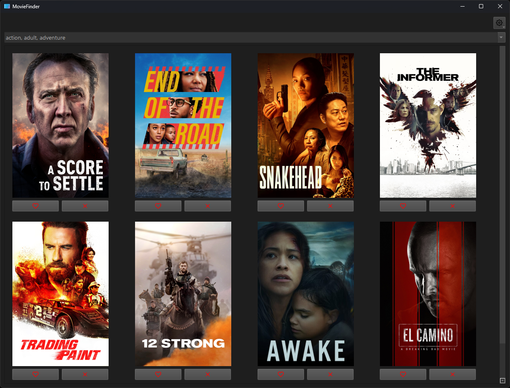

# COMP587-Project-App

The front-end application of the software system under test for [COMP 587 : Verification &amp; Validation project](https://github.com/chizuo/COMP587-Project).

## download

You can download the app [here](https://github.com/chizuo/COMP587-MovieApplication/releases) or install from source following the instructions below.

## dev environment setup

0. Install [Python 3.10](https://www.python.org/downloads/release/python-3108/) if you haven't already.
1. Use `git clone https://github.com/chizuo/COMP587-MovieApplication.git` where you want the project's folder to appear and `cd` into the new folder.
2. Create a virtual environment, such as with `py -3.10 -m venv venv` or `python3.10 -m venv venv`.
3. [Activate the virtual environment](https://python.land/virtual-environments/virtualenv).
4. Use `pip install -r requirements.txt` to install the app's dependencies.
5. If you will edit the app, use `pip install -r requirements-dev.txt` to install the development dependencies.
6. If you will make commits, run `pre-commit install` to set up the git [pre-commit](https://pre-commit.com/) hooks.
7. Choose whether `USE_MOCK_DATA` (in [dev_settings.py](https://github.com/chizuo/COMP587-MovieApplication/blob/main/src/moviefinder/dev_settings.py)) should be set to `True` or `False`.

After the environment is set up, you can use these commands (while in the project's root folder):

* `briefcase dev` to run the app in dev mode. See [BeeWare Briefcase's docs](https://docs.beeware.org/en/latest/tutorial/tutorial-3.html) for more info if needed.
* `pytest` to run the unit tests.
* `pre-commit run --all-files` to run all the pre-commit hooks without committing.
* `pre-commit run hook-id-here --file file-path-here.py` to run one pre-commit hook on one file without committing.

### distribution

* `briefcase dev` to run the app in dev mode.
* `briefcase create` to create the app template.
* `briefcase update` to copy new changes into the platform directory.
* `briefcase update -d` to update the dependencies in the packaged app.
* `briefcase build` to compile the app.
* `briefcase run` to run the compiled app.
* `briefcase run -u` to update, build, and run the compiled app.
* `briefcase package` to create the app's installer for the current platform.
* `briefcase package -u` to update, build, and create the app's installer for the current platform.

## dependency docs

* [Python](https://docs.python.org/3/)
* [pytest](https://docs.pytest.org/en/6.2.x/contents.html)
* [pytest-qt](https://pytest-qt.readthedocs.io/en/latest/intro.html)
* [PySide](https://doc.qt.io/qtforpython/index.html)
* [BeeWare Briefcase](https://briefcase.readthedocs.io/en/latest/)
* [pre-commit](https://pre-commit.com/)
* [Black](https://black.readthedocs.io/en/stable/)
* [mypy](https://mypy.readthedocs.io/en/stable/)
* [flake8](https://flake8.pycqa.org/en/latest/)
